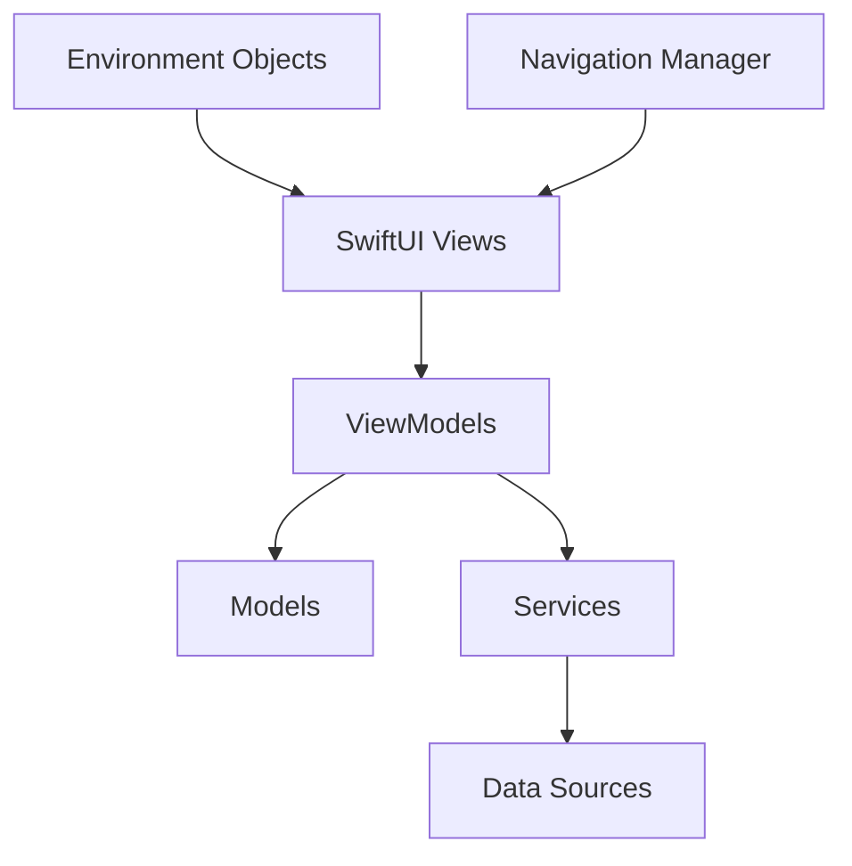
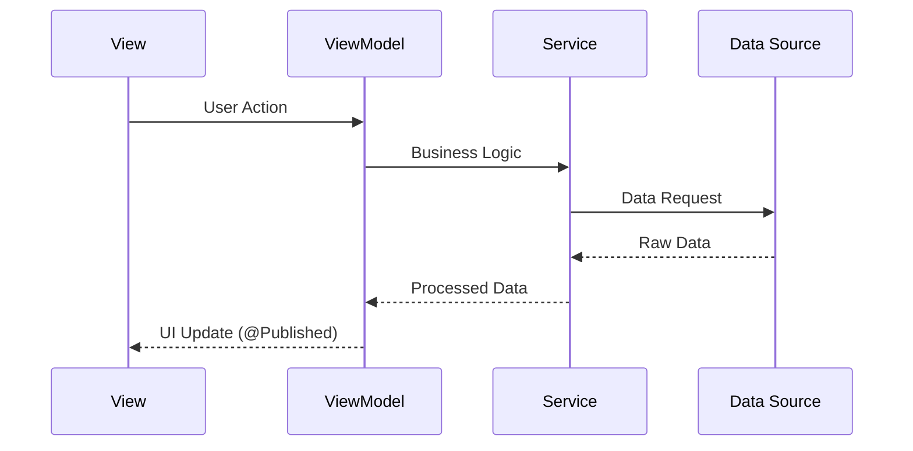

# MuTeLu - System Architecture Documentation
## เอกสารสถาปัตยกรรมระบบ

### ภาพรวมสถาปัตยกรรม (Architecture Overview)

MuTeLu ใช้สถาปัตยกรรมแบบ **MVVM (Model-View-ViewModel)** ร่วมกับ **SwiftUI** เป็นหลัก โดยมีการจัดการ state แบบ reactive programming ผ่าน **Combine framework** และ **ObservableObject protocol**



## 1. Presentation Layer (UI Layer)

### 1.1 SwiftUI Views
**ตำแหน่ง**: Root level `.swift` files และ subdirectories

#### หลักการออกแบบ:
- **Declarative UI**: ใช้ SwiftUI แบบ declarative programming
- **Composition over Inheritance**: แยก views เป็น components เล็กๆ
- **State-driven UI**: UI เปลี่ยนแปลงตาม state ของ data

#### โครงสร้าง Views:
```swift
// Entry Point
MuTeLuApp.swift              // @main App struct
├── RootWrapperView.swift    // Root wrapper
└── AppView.swift            // Main app router

// Screen Categories
├── Home/
│   ├── HomeView.swift       // Tab-based home screen
│   ├── MainMenuView.swift   // Main menu with cards
│   └── GreetingHeaderCard.swift
├── Authentication/
│   ├── LoginView.swift
│   ├── RegistrationView.swift
│   └── AdminLoginView.swift
├── Profile/
│   ├── ProfileView.swift
│   └── EditProfileView.swift
├── Sacred Places/
│   ├── SacredPlaceDetailView.swift
│   ├── RecommendationView.swift
│   └── RecommenderForYouView.swift
├── Fortune Telling/
│   ├── PhoneFortuneView.swift
│   ├── ShirtColorView.swift
│   ├── CarPlateView.swift
│   ├── HouseNumberView.swift
│   ├── TarotView.swift
│   └── SeamSiView.swift
├── Games/
│   ├── GameMenuView.swift
│   ├── OfferingGameView.swift
│   └── MeritPointsView.swift
└── Knowledge/
    ├── KnowledgeMenuView.swift
    ├── MantraView.swift
    └── WishDetailView.swift
```

### 1.2 Navigation Architecture
**File**: `MuTeLuFlowManager.swift`

```swift
// Centralized Navigation Management
class MuTeLuFlowManager: ObservableObject {
    @Published var currentScreen: MuTeLuScreen = .home
    @Published var isLoggedIn: Bool = false
}

enum MuTeLuScreen {
    case home, login, registration, editProfile
    case recommenderForYou, recommendation
    case sacredDetail(place: SacredPlace)
    case phoneFortune, shirtColor, carPlate
    case tarot, mantra, seamSi
    case admin, gameMenu, offeringGame
}
```

**หลักการ**:
- **Single Source of Truth**: ใช้ enum เก็บ state ของหน้าจอ
- **Environment Object**: แชร์ FlowManager ผ่าน environment
- **Type Safety**: ใช้ associated values สำหรับส่งข้อมูลระหว่างหน้า

### 1.3 Component Architecture
```swift
// Reusable Components
├── BackButton.swift         // Custom back button
├── MenuButton.swift         // Menu item button
├── MapSnapshotView.swift    // Map preview component
└── Banner/
    ├── DailyBannerView.swift
    ├── BuddhistDayBanner.swift
    └── ReligiousHolidayBanner.swift
```

## 2. Business Logic Layer (ViewModels)

### 2.1 MVVM Implementation

#### ObservableObject Pattern:
```swift
class OfferingGameViewModel: ObservableObject {
    @Published var basket: [OfferingItem] = []
    @Published var currentLevel = 0
    
    // Computed Properties
    var currentOfferingLevel: OfferingLevel { 
        offeringLevels[currentLevel] 
    }
    
    // Business Logic Methods
    func addItem(_ item: OfferingItem) { }
    func checkResult() -> Bool { }
}
```

#### Key ViewModels:
1. **OfferingGameViewModel** (`OfferingGameViewModel.swift`)
   - จัดการเกมสังฆทาน
   - ตรรกะการคำนวณงบประมาณ
   - การตรวจสอบความถูกต้องของเครื่องสักการะ

2. **SacredPlaceViewModel** (`SacredPlaceViewModel.swift`)
   - โหลดข้อมูลสถานที่จาก JSON
   - กรองข้อมูลตามหมวดหมู่
   - จัดการ state ของการแสดงผล

### 2.2 State Management Stores

#### MemberStore Pattern:
```swift
class MemberStore: ObservableObject {
    @Published var members: [Member] = [] {
        didSet { saveMembers() }
    }
    
    // Persistence
    func saveMembers() { /* UserDefaults */ }
    func loadMembers() { /* UserDefaults */ }
}
```

#### Key Stores:
1. **MemberStore** - จัดการข้อมูลสมาชิก
2. **CheckInStore** - จัดการประวัติ check-in
3. **AppLanguage** - จัดการภาษาและธีม

## 3. Domain Layer (Models)

### 3.1 Core Models

#### Member Model:
```swift
struct Member: Identifiable, Codable {
    let id: UUID
    var email: String
    var fullName: String
    var birthdate: Date
    var meritPoints: Int
    var role: UserRole        // Admin/User
    var status: AccountStatus // Active/Suspended
}

enum UserRole: String, Codable {
    case admin = "Admin"
    case user = "User"
}
```

#### SacredPlace Model:
```swift
struct SacredPlace: Codable, Identifiable {
    var id: UUID = UUID()
    let nameTH: String
    let nameEN: String
    let latitude: Double
    let longitude: Double
    let tags: [String]        // Recommendation system
    let rating: Double
    let details: [DetailItem] // Multi-language details
}
```

#### CheckIn Model:
```swift
struct CheckInRecord: Codable, Identifiable {
    var id: UUID = UUID()
    let placeID: String
    let memberEmail: String
    let date: Date
    let meritPoints: Int
    let latitude: Double
    let longitude: Double
}
```

### 3.2 Supporting Models

1. **OfferingItem** - เครื่องสักการะในเกม
2. **OfferingLevel** - ระดับความยากในเกม
3. **NumberMeaning** - ความหมายของตัวเลข
4. **LuckyColour** - สีมงคลประจำวัน

## 4. Service Layer

### 4.1 Location Services

#### LocationManager:
```swift
class LocationManager: NSObject, ObservableObject {
    @Published var userLocation: CLLocation?
    @Published var authorizationStatus: CLAuthorizationStatus
    
    private let locationManager = CLLocationManager()
    
    func requestPermission() { }
    func startLocationUpdates() { }
}
```

#### RouteDistanceService:
```swift
class RouteDistanceService {
    static let shared = RouteDistanceService()
    
    func batchDistances(
        from: CLLocationCoordinate2D,
        places: [SacredPlace],
        mode: MKDirectionsTransportType
    ) async -> [(place: SacredPlace, meters: CLLocationDistance)]
}
```

### 4.2 Recommendation Engine

#### Machine Learning Approach:
```swift
class RecommendationEngine {
    private let places: [SacredPlace]
    private var placeVectors: [UUID: [Int]] = [:]
    
    // Vector Space Model
    private func vectorizePlaces() { }
    
    // Cosine Similarity Algorithm
    private func cosineSimilarity(vecA: [Int], vecB: [Int]) -> Double
    
    // Main Recommendation Function
    func getRecommendations(
        basedOn sourcePlace: SacredPlace,
        excluding visitedPlaceIDs: [UUID],
        top: Int = 3
    ) -> [SacredPlace]
}
```

**Algorithm**:
1. **Vectorization**: แปลง tags เป็น binary vectors
2. **Cosine Similarity**: คำนวณความคล้ายคลึง
3. **Ranking**: จัดอันดับตามคะแนน similarity

### 4.3 Data Loading Services

#### JSON Data Loaders:
```swift
func loadSacredPlaces() -> [SacredPlace] {
    // Bundle.main.url(forResource: "SacredPlacesDataNew", withExtension: "json")
}

class LuckyColourLoader: ObservableObject {
    func loadColours() -> [LuckyColour] { }
}

class NumberMeaningLoader: ObservableObject {
    func loadMeanings() -> [NumberMeaning] { }
}
```

## 5. Data Layer

### 5.1 Persistence Strategy

#### UserDefaults (Primary):
```swift
// Light-weight data (user preferences, small lists)
UserDefaults.standard.set(data, forKey: "saved_members")
UserDefaults.standard.set(email, forKey: "loggedInEmail")
```

#### Bundle Resources (Static Data):
```
Resources/
├── SacredPlacesDataNew.json  // 2.1MB - พิกัดวัดและข้อมูล
├── LuckyColour.json          // สีมงคลรายวัน
├── numberMeaning.json        // ความหมายตัวเลข
└── Wish.txt                  // คำอธิษฐาน
```

#### Assets (Media):
```
Assets.xcassets/
├── Logo.imageset/
├── wat_pho.imageset/
├── wat_arun.imageset/
└── [20+ sacred place images]
```

### 5.2 Data Flow Architecture



## 6. Cross-Cutting Concerns

### 6.1 Internationalization (i18n)

#### AppLanguage Service:
```swift
class AppLanguage: ObservableObject {
    @Published var currentLanguage: String = "th"
    
    func localized(_ th: String, _ en: String) -> String {
        return currentLanguage == "th" ? th : en
    }
}
```

#### Usage Pattern:
```swift
Text(language.localized("หน้าหลัก", "Home"))
```

### 6.2 Dependency Injection

#### Environment Objects Pattern:
```swift
// App Entry Point
WindowGroup {
    RootWrapperView()
        .environmentObject(AppLanguage())
        .environmentObject(MuTeLuFlowManager())
        .environmentObject(LocationManager())
        .environmentObject(MemberStore())
        .environmentObject(CheckInStore())
}

// View Usage
struct HomeView: View {
    @EnvironmentObject var language: AppLanguage
    @EnvironmentObject var flowManager: MuTeLuFlowManager
    // ...
}
```

### 6.3 Error Handling

#### Loading States:
```swift
// JSON Loading with Error Handling
do {
    let data = try Data(contentsOf: url)
    let decoded = try JSONDecoder().decode([SacredPlace].self, from: data)
    self.places = decoded
    print("✅ โหลดสำเร็จ: \(decoded.count) สถานที่")
} catch {
    print("❌ JSON Decode Error: \(error.localizedDescription)")
}
```

#### Location Permission Handling:
```swift
func locationManager(_ manager: CLLocationManager, didFailWithError error: Error) {
    print("Location error: \(error.localizedDescription)")
    // Handle location unavailable gracefully
}
```

## 7. Performance Optimizations

### 7.1 Memory Management

#### Lazy Loading:
```swift
// Load sacred places data only when needed
private let sacredPlaces = loadSacredPlaces()

// Compute route distances on-demand
private func computeRouteNearest() async { }
```

#### State Optimization:
```swift
// Reduce frequency of expensive calculations
if let last = lastComputedLocation {
    let moved = userCL.distance(from: last)
    if moved < 50 { return } // Skip if moved less than 50m
}
```

### 7.2 Async Operations

#### Route Distance Calculation:
```swift
func checkProximityToSacredPlaces() {
    Task { await computeRouteNearest() }
}

private func computeRouteNearest() async {
    // Background thread calculation
    let routed = await RouteDistanceService.shared.batchDistances(...)
    
    // Update UI on main thread
    await MainActor.run {
        self.nearestWithDistance = nearest3
        self.topRatedPlaces = Array(top3Review)
    }
}
```

## 8. Testing Architecture

### 8.1 Testable Design

#### Dependency Injection:
```swift
// ViewModels accept dependencies
class SacredPlaceViewModel: ObservableObject {
    private let dataLoader: DataLoaderProtocol
    
    init(dataLoader: DataLoaderProtocol = DefaultDataLoader()) {
        self.dataLoader = dataLoader
    }
}
```

#### Mockable Services:
```swift
protocol LocationServiceProtocol {
    func getCurrentLocation() async -> CLLocation?
}

class MockLocationService: LocationServiceProtocol {
    func getCurrentLocation() async -> CLLocation? {
        return CLLocation(latitude: 13.7563, longitude: 100.5018)
    }
}
```

### 8.2 Preview Support

#### SwiftUI Previews:
```swift
#Preview {
    let mockFlowManager = MuTeLuFlowManager()
    let mockLanguage = AppLanguage()
    let mockLocationManager = LocationManager()
    let mockMemberStore = MemberStore()
    
    return AppView()
        .environmentObject(mockFlowManager)
        .environmentObject(mockLanguage)
        .environmentObject(mockLocationManager)
        .environmentObject(mockMemberStore)
}
```

## 9. Security Considerations

### 9.1 Data Protection

#### Local Storage Security:
```swift
// No sensitive data in UserDefaults
// Passwords stored as plain text (⚠️ Security Issue)
// TODO: Implement Keychain for password storage
```

#### Location Privacy:
```swift
// Request location permission with purpose string
// Only access location when necessary
// Allow users to opt-out of location features
```

### 9.2 Input Validation

#### Form Validation:
```swift
// Email format validation
// Required field checks
// Date range validation for birthdates
```

## 10. การขยายระบบในอนาคต (Future Scalability)

### 10.1 Architecture Improvements

#### Suggested Enhancements:
1. **Repository Pattern**: แยก data access layer
2. **Use Cases/Interactors**: แยก business logic ออกจาก ViewModels
3. **Dependency Injection Container**: ใช้ container เช่น Swinject
4. **Core Data**: สำหรับข้อมูลขนาดใหญ่
5. **SwiftUI Navigation**: อัปเกรดเป็น NavigationStack (iOS 16+)

### 10.2 Performance Optimizations

#### Future Considerations:
1. **Image Caching**: สำหรับรูปสถานที่ศักดิ์สิทธิ์
2. **Offline Support**: Local database สำหรับการใช้งานแบบ offline
3. **Background Sync**: ซิงค์ข้อมูลเมื่อมี internet
4. **Push Notifications**: แจ้งเตือนวันสำคัญ

### 10.3 Code Organization

#### Modular Architecture:
```
MuTeLu/
├── Core/
│   ├── Navigation/
│   ├── Networking/
│   └── Persistence/
├── Features/
│   ├── Authentication/
│   ├── SacredPlaces/
│   ├── Fortune/
│   └── Games/
├── Shared/
│   ├── Models/
│   ├── Services/
│   └── Extensions/
└── Resources/
```

---

## สรุป (Summary)

สถาปัตยกรรมของ MuTeLu ใช้หลักการ **MVVM + SwiftUI** อย่างชัดเจน โดยมีการแยกหน้าที่ของแต่ละ layer อย่างเหมาะสม:

- **View Layer**: SwiftUI views พร้อม component reusability
- **ViewModel Layer**: Business logic และ state management  
- **Model Layer**: Data structures และ domain objects
- **Service Layer**: External services (location, recommendations)
- **Data Layer**: JSON loading และ UserDefaults persistence

การออกแบบนี้ทำให้โค้ดมี **testability**, **maintainability**, และ **scalability** ที่ดี เหมาะสำหรับการพัฒนาแอปพลิเคชั่นขนาดกลางถึงขนาดใหญ่

---
*Architecture Documentation*  
*Created: 2025-09-26*  
*Version: 1.0*